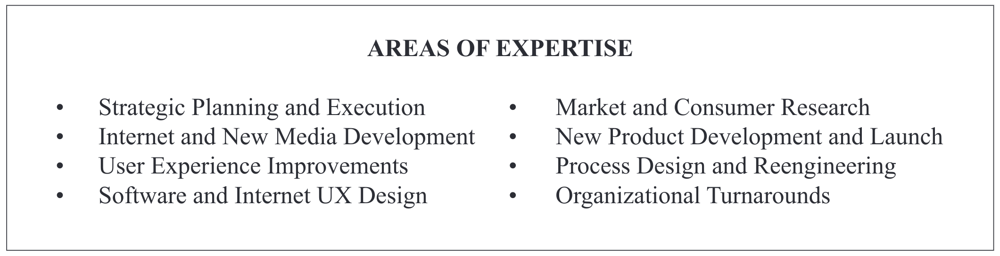

写给大家看的设计书

The Non-Designer's Design Book

Robin Patricia Williams

<!--
-->

---
transition: none
layout: image-left
image: ./public/image/joshua-tree.png
---

<h1 class="fzdbsjw">约书亚树</h1>

    很多年前的一个圣诞节，我收到一份圣诞礼物，是一本关于如何认识各种树的书。
当时我住在父母家，所有礼物都打开后，我决定出去走走，认一认邻居家的树。出去之前我读了书的一部分。其中提到的第一种树是约书亚树，只需要两个线索就能认出它。由于约书亚树相当怪异，所以看到书中它的照片时，我对自己说：“哦，北加利福尼亚绝对没有这种树。这种树太怪异了。如果我见过，肯定应该有印象，可我以前从来没有见过。”

---
transition: none
layout: image-left
image: ./public/image/joshua-tree.png
---

    之后我拿着这本书走出家门。我的父母住在一个小巷子里，这里共有 6 家住户。其中 4 家的前院里都赫然立着约书亚树。我住在那里已经有 13 年了，此前居然从未注意过约书亚树。我在这个街区转了转，发现至少 80% 的住家前院都种有约书亚树。而我在此之前居然从来没有注意过！在我知道了这种树之后，我是说在我能够说出它的名字后，它就无处不在了。

---
transition: fade-out
layout: image-left
image: ./public/image/joshua-tree.png
---

一旦能够说出什么东西的名字，就会很容易注意到它。你就会掌握它，拥有它，让它受你所控。

---
layout: center
transition: slide-left
---

<h1 class="fzdbsjw">四大基本原则</h1>

<li class="fzdbsjw">对比（Contrast）</li>
<li class="fzdbsjw">重复（Repetition）</li>
<li class="fzdbsjw">对齐（Alignment）</li>
<li class="fzdbsjw">亲密性（Proximity）</li>

---
layout: image-left
image: ./public/image/proximity.png
---
<h1 class="fzdbsjw">亲密性（Proximity）</h1>

彼此相关的项应当靠近，归组在一起。如果多个项相互之间存在很近的亲密性，它们就会成为一个视觉单元，而不是多个孤立的元素。这有助于组织信息，减少混乱，为读者提供清晰的结构。

---
class: px-20
transition: slide-left
---

<h1 class="fzdbsjw">亲密性原则</h1>

  

    
  

  

    
  

  

    
  

  

    <li>把相关的元素分为一组。</li>
    <li>统一使用了居中对齐。</li>
    <li>对姓名的字体适当加粗。</li>
  

---
class: px-40
transition: slide-left
---

<h1 class="fzdbsjw">亲密性原则</h1>

    

      

        
      

      

        
      

    

---
class: px-20
transition: slide-left
---

<h1 class="fzdbsjw">亲密性原则</h1>

  

    
  

  

    
  

  

    <li>标题更大。</li>
    <li>其他部分的字更小。</li>
    <li>三种服务列在独立的三行。</li>
    <li>把相关元素集中在一起。</li>
    <li>把邮箱和网址的字母大写，让它们更易读。</li>
    <li>去掉多余的心形。</li>
    <li>去掉 available 这个词。</li>
    <li>把心形变浅，不要让它和文字争夺注意力。</li>
    <li>把心形放大，让它和文本重叠融为一体。</li>
  

---
class: px-50
transition: slide-left
---

<h1 class="fzdbsjw">亲密性原则</h1>

    

      

        
      

      

        
      

    

---
layout: image-left
transition: slide-left
image: ./public/image/contrast.png
---

<h1 class="fzdbsjw">对比（Contrast）</h1>

对比的基本思想是，要避免页面上的元素太过相似。如果元素（字体、颜色、大小、线宽、形状、空间等）不相同，那就干脆让它们截然不同。要让页面引人注目，对比通常是最重要的一个因素，正是它能使读者首先看这个页面。

---
layout: image-left
image: ./public/image/repetition.png
transition: slide-left
---

<h1 class="fzdbsjw">重复（Repetition）</h1>

让设计中的视觉要素在整个作品中重复出现。可以重复颜色、形状、材质、空间关系、线宽、字体、大小和图片，等等。这样一来，既能增加条理性，还可以加强统一性。

---
layout: image-left
transition: slide-left
image: ./public/image/alignment.png
---

<h1 class="fzdbsjw">对齐（Alignment）</h1>

任何东西都不能在页面上随意安放。每个元素都应当与页面上的另一个元素有某种视觉联系。这样能建立一种清晰、精巧而且清爽的外观。

---
class: px-20
transition: slide-left
---

<h1 class="fzdbsjw">对齐原则</h1>

  

    
  

  

    
  

  

    
  

  

    <li>将信息按照亲密性原则进行分组。</li>
    <li>统一使用左对齐。</li>
    <li>将字重适当加重。</li>
    <li>左对齐比居中对齐边界更硬，对齐更明确</li>  

---
class: px-50
transition: slide-left
---

<h1 class="fzdbsjw">对齐原则</h1>

  

    
  

  

    
  

  

    
  

---
class: px-20
transition: slide-left
---

<h1 class="fzdbsjw">对齐原则</h1>

  

    
  

  

    
  

  

    
  

  

    
  

<!--
2. 不同行长让居中布局看起来确实很居中。
行之间的间隔在引用文字中是一致的。
字体不那么又大又长。

字体很可爱。

3. 有趣的字体
有趣的图画。

居中对齐是很明确的居中。

4. 粗壮有力
文字后面有黑色带，文字反转出来。

微妙地利用合适的装饰。
-->

---
class: px-50
transition: slide-left
---

<h1 class="fzdbsjw">对齐原则</h1>

  

    
  

  

    
  

---
class: px-50
transition: slide-left
---

<h1 class="fzdbsjw">对齐原则</h1>

  

    
  

  

    
  

