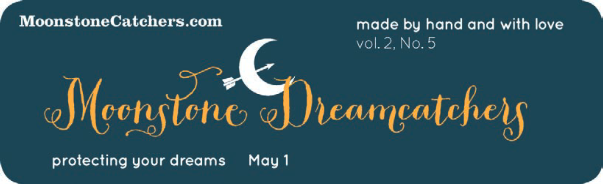
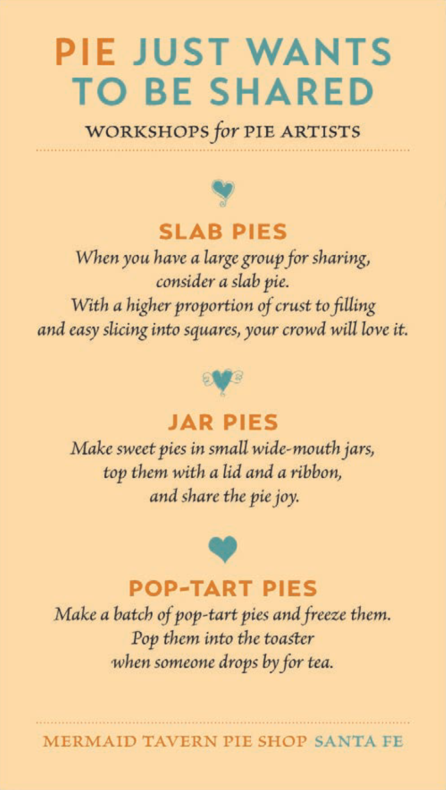

写给大家看的设计书

The Non-Designer's Design Book

Robin Patricia Williams

<!--
-->

---
transition: none
layout: image-left
image: ./public/image/joshua-tree.png
---

<h1 class="fzdbsjw">约书亚树</h1>

    很多年前的一个圣诞节，我收到一份圣诞礼物，是一本关于如何认识各种树的书。
当时我住在父母家，所有礼物都打开后，我决定出去走走，认一认邻居家的树。出去之前我读了书的一部分。其中提到的第一种树是约书亚树，只需要两个线索就能认出它。由于约书亚树相当怪异，所以看到书中它的照片时，我对自己说：“哦，北加利福尼亚绝对没有这种树。这种树太怪异了。如果我见过，肯定应该有印象，可我以前从来没有见过。”

---
transition: none
layout: image-left
image: ./public/image/joshua-tree.png
---

    之后我拿着这本书走出家门。我的父母住在一个小巷子里，这里共有 6 家住户。其中 4 家的前院里都赫然立着约书亚树。我住在那里已经有 13 年了，此前居然从未注意过约书亚树。我在这个街区转了转，发现至少 80% 的住家前院都种有约书亚树。而我在此之前居然从来没有注意过！在我知道了这种树之后，我是说在我能够说出它的名字后，它就无处不在了。

---
transition: fade-out
layout: image-left
image: ./public/image/joshua-tree.png
---

一旦能够说出什么东西的名字，就会很容易注意到它。你就会掌握它，拥有它，让它受你所控。

---
layout: center
transition: slide-left
---

<h1 class="fzdbsjw">四大基本原则</h1>

<li class="fzdbsjw">对比（Contrast）</li>
<li class="fzdbsjw">重复（Repetition）</li>
<li class="fzdbsjw">对齐（Alignment）</li>
<li class="fzdbsjw">亲密性（Proximity）</li>

---
layout: image-left
image: ./public/image/proximity.png
---
<h1 class="fzdbsjw">亲密性（Proximity）</h1>

彼此相关的项应当靠近，归组在一起。如果多个项相互之间存在很近的亲密性，它们就会成为一个视觉单元，而不是多个孤立的元素。这有助于组织信息，减少混乱，为读者提供清晰的结构。

---
class: px-20
transition: slide-left
---

<h1 class="fzdbsjw">亲密性原则</h1>

  

    
  

  

    
  

  

    
  

  

    <li>把相关的元素分为一组。</li>
    <li>统一使用了居中对齐。</li>
    <li>对姓名的字体适当加粗。</li>
  

---
class: px-40
transition: slide-left
---

<h1 class="fzdbsjw">亲密性原则</h1>

    

      

        
      

      

        
      

    

---
class: px-20
transition: slide-left
---

<h1 class="fzdbsjw">亲密性原则</h1>

  

    
  

  

    
  

  

    <li>标题更大。</li>
    <li>其他部分的字更小。</li>
    <li>三种服务列在独立的三行。</li>
    <li>把相关元素集中在一起。</li>
    <li>把邮箱和网址的字母大写，让它们更易读。</li>
    <li>去掉多余的心形。</li>
    <li>去掉 available 这个词。</li>
    <li>把心形变浅，不要让它和文字争夺注意力。</li>
    <li>把心形放大，让它和文本重叠融为一体。</li>
  

---
class: px-50
transition: slide-left
---

<h1 class="fzdbsjw">亲密性原则</h1>

    

      

        
      

      

        
      

    

---
layout: image-left
transition: slide-left
image: ./public/image/alignment.png
---

<h1 class="fzdbsjw">对齐（Alignment）</h1>

任何东西都不能在页面上随意安放。每个元素都应当与页面上的另一个元素有某种视觉联系。这样能建立一种清晰、精巧而且清爽的外观。

---
class: px-50
transition: slide-left
---

<h1 class="fzdbsjw">对齐原则</h1>

  

    
  

  

    
  

  

    
  

---
class: px-20
transition: slide-left
---

<h1 class="fzdbsjw">对齐原则</h1>

  

    
  

  

    
  

  

    
  

  

    
  

<!--
2. 不同行长让居中布局看起来确实很居中。
行之间的间隔在引用文字中是一致的。
字体不那么又大又长。

字体很可爱。

3. 有趣的字体
有趣的图画。

居中对齐是很明确的居中。

4. 粗壮有力
文字后面有黑色带，文字反转出来。

微妙地利用合适的装饰。
-->

---
class: px-50
transition: slide-left
---

<h1 class="fzdbsjw">对齐原则</h1>

    
    

<!--
https://www.foundertype.com/index.php/News/newsdetails/id/76.html
-->

---
class: px-20
transition: slide-left
---

<h1 class="fzdbsjw">亲密性原则</h1>

  

    
  

  

    
  

  

    <li>标题被放大了一些，这样它就和照片对齐了。</li>
    <li>副标题被归入更亲的亲密性中。</li>
    <li>保持了底部明显的右对齐，为网址单独设立了一行，这样做让信息更清晰。</li>
    <li>网址中加入了大写字母，所以读起来更容易。</li>
    <li>下半页的第二个logo 被削减了一些，所以它不会和上面那个争夺注意力。</li>
  

---
layout: image-left
image: ./public/image/repetition.png
transition: slide-left
---

<h1 class="fzdbsjw">重复（Repetition）</h1>

让设计中的视觉要素在整个作品中重复出现。可以重复颜色、形状、材质、空间关系、线宽、字体、大小和图片，等等。这样一来，既能增加条理性，还可以加强统一性。

---
class: px-50
transition: slide-left
---

<h1 class="fzdbsjw">重复原则</h1>

  

    
  

  

    
  

  <Arrow v-click="3" x1="110" y1="140" x2="230" y2="123" width="1" color="gray"/>
  
所有页面上都有一致的双线。

  <Arrow v-click="4" x1="100" y1="280" x2="220" y2="308" width="1" color="gray"/>
  

        
标题和子标题字体一致，而

        
且每个标题和子标题之上有

        一致的空白。
  

  <Arrow v-click="5" x1="100" y1="420" x2="220" y2="460" width="1" color="gray"/>
  

        
页码放在每一页上的同一个

        
位置，而且字体相同。

  

  <Arrow v-click="6" x1="860" y1="205" x2="760" y2="260" width="1" color="gray"/>
  

        
这一列很宽，占了两列的宽

        
度，从而维持外边框的一致性。

  

  <Arrow v-click="7" x1="785" y1="320" x2="653" y2="357" width="1" color="gray"/>
  

    
注意列表和上一页图题中重

    
复使用了三角形。这个形状

    
可能还在这个出版物的其他

    
位置用到。

  

  <Arrow v-click="8" x1="860" y1="435" x2="760" y2="455" width="1" color="gray"/>
  

        
每一页的底部都重复出现这

        
条单线。

  

---
class: px-50
transition: slide-left
---

<h1 class="fzdbsjw">重复原则</h1>

  

    
  

  

    
  

<!--
workshop 名称使用的标题字体。
副标题和页脚的衬线体。

每个workshop 中的衬线斜体。
两种颜色。

Workshop 之间的间距。
点划线。

字和点划线之间的间隔。

用字体选择、间距、适合的剪贴画、无边框来避免业余的居中对齐。
-->

---
class: px-20
transition: slide-left
---

<h1 class="fzdbsjw">重复原则</h1>

  

    
  

  

    
  

  

    
  

  

    <li>重复使用相同的字体。</li>
    <li>没有使用居中对齐。</li>
    <li>运用了对比性原则。</li>
  

---
class: px-20
transition: slide-left
---

<h1 class="fzdbsjw">重复原则</h1>

  

    
  

  

    <li>两个字体。</li>
    <li>精巧的大写。</li>
    <li>文本颜色中的背景颜色。</li>
    <li>第二种颜色蓝和橙色的互补色。</li>
    <li>正文和题目文字水平对齐。</li>
  

  

    
  

  

    <li>深栗色。</li>
    <li>泡泡的绿色。</li>
    <li>框的明显对齐和文本的明显对齐。</li>
  

---
layout: image-left
transition: slide-left
image: ./public/image/contrast.png
---

<h1 class="fzdbsjw">对比（Contrast）</h1>

对比的基本思想是，要避免页面上的元素太过相似。如果元素（字体、颜色、大小、线宽、形状、空间等）不相同，那就干脆让它们截然不同。要让页面引人注目，对比通常是最重要的一个因素，正是它能使读者首先看这个页面。

---
class: px-20
transition: slide-left
---

<h1 class="fzdbsjw">对比原则</h1>

  

    
  

  

    
  

  

    <li>去掉了 Times New Roman 字体。</li>
    <li>用手写体作为标题，用无衬线体作为其余文本的字体。</li>
    <li>增加了深紫色色带。</li>
    <li>为了配合衬线粗体字加入了深紫色。</li>
    <li>为了增加对比，去掉了浅紫色背景。</li>
    <li>为了让心形图案不过度干扰文字，减小了心形的面积。</li>
    <li>心的位置提高了，打开了空间。</li>
  

---
class: px-20
transition: slide-left
---

<h1 class="fzdbsjw">对比原则</h1>

  

    
  

  

    
  

  

    <li>边框被改得更细（半磅）。</li>
    <li>把全大写变成大小混写。</li>
    <li>删掉了诸如telephone（电话）、zip code（邮编）、area code（区号）（因为这是本地报纸上登的本地广告）这样的不必要信息，腾出了更大的空间。</li>
    <li>放大派并且让它飘起来（可以用Photoshop 把背景变得透明）。</li>
    <li>调整了派的种类之后，它们更好地配合了空间。</li>
    <li>大多数文字靠左对齐了；一些元素靠右对齐。</li>
    <li>派店的口号重复了店名的字体。</li>
    <li>派店的口号被设置成曲线形。</li>
    <li>把a pie gallery（派的美术馆）挪到了标题位置，因为店里确实有派艺展览。</li>
  

---
class: px-50
transition: slide-left
---

<h1 class="fzdbsjw">对比原则</h1>

  

    
  

  

    
  

  

    <li>背景是深厚的黑色（百分之二十的蓝绿色、品红以及黄色，还有百分之百的黑色）。</li>
    <li>题目更大了。</li>
    <li>标题和logo 字体匹配（重复原则）。</li>
    <li>字体使用了常规磅数而非细体磅数，所以在黑色中反白的时候效果更好。</li>
  

---
class: px-50
transition: slide-left
---

<h1 class="fzdbsjw">对比原则</h1>

  

    
  

  

    
  

